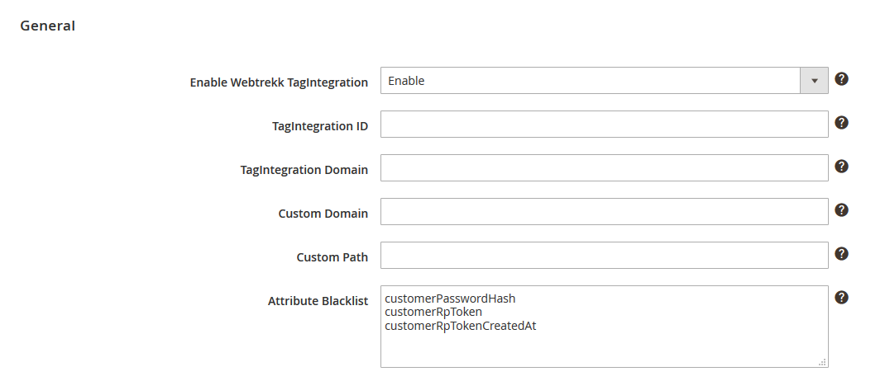

Integration und Konfiguration der Webtrekk Magento2 Extension | Version $version$

# Einführung

Die Webtrekk Magento2 Extension ermöglicht Ihnen in eine einfache Integration des Webtrekk Pixels in Ihren 
Magento2-Onlineshop. Jede Seite des Shops wird mit dem Webtrekk-Pixelcode (in der Version 4) versehen. Auf diese Weise 
werden alle Standardparameter erfasst.

Folgende Auswertungen sind damit möglich:

- Trafficanalysen (inkl. Ausweisung von (Neu-, & Stamm-)Besuchern)
- ECommerce Analysen (inkl. Produkt- und Bestellauswertungen, allerdings ohne individuelle Konfigurationen)
- Standard-Marketinganalysen, d.h. automatisch erkennbare Nutzerherkunft wie SEO, Direkt oder Referrer (ohne Ausweisung individueller Kampagnen)
- Seitenanalysen (inkl. Heatmap)
- Aktionsanalysen (mit Variante Link)
- Formularanalysen (Aktivierung erforderlich)

Entwickelt wurde die Extension für Magento2 v2.0.x und v2.1.x in Kombination mit dem Webtrekk Pixel in der Version 4 (D.h. 
zusätzlich zu dem Magento2 Extension-Dateien benötigen Sie eine entsprechende JS-Datei des Pixels).

Dieses Dokument gibt eine Übersicht über die gesetzten Werte auf den Einzelseiten und beschreibt die Einbindung der 
Extension in Ihr Magento2-System.

# Magento2 Extension

## Funktionsweise

Die Erweiterung übernimmt für Sie die Erstellung eines Pixelkonzepts. Anhand der in Magento2 gesetzten 
Produktinformation werden die Webtrekk-Pixelparameter automatisch befüllt.

Die Generierung dieser Parameterwerte (z.B. die Erstellung der Seitennamen) erfolgt mit Hilfe vordefinierter 
Algorithmen.

Einige Funktionen wie das Aktions-, Heatmap- und Formulartracking können von Ihnen selbst auf jeder Einzelseite nach 
Bedarf aktiviert bzw. deaktiviert werden. 

## Installation

Um die Installation der Extension zu beginnen, enpacken Sie das mitgelieferte ZIP-Archiv auf Ihren Server unter 
"<Magento2 install DIR>/app/code". Jetzt können Sie die Extension über folgendes Kommando installieren und aktivieren.  

```example
# php bin/magento setup:upgrade
# php bin/magento setup:static-content:deploy
```

Anschließend leeren Sie den Cache im Magento2 Admin-Panel unter "System > Cache Management".

## Konfiguration

Nachdem installieren der Extension gehen Sie im Magento2 Admin-Panel unter "Stores > Configuration > Webtrekk > 
TagIntegration". Anschließend wählen Sie Ihren Shop, in dem Webtrekk TagIntegration aktiviert werden soll und 
hinterlegen dort Ihre Basiskonfiguration.



- **Enable Webtrekk TagIntegration:** Hier können Sie die Webtrekk Extension zusätzlich aktivieren bzw. deaktivieren.
- **Webtrekk JavaScript file:** Hier können Sie den Pfad zur Webtrekk JavaScript Datei eintragen (/webtrekk_v4.min.js). Wenn Sie dieses Feld leer lassen, nutzt die Extension automatisch die in der Extension hinterlegte JavaScript Datei (Webtrekk Pixel v435).
- **Async:** Legt fest, ob der TagIntegration-Container asynchron geladen werden soll.
- **TagIntegration ID:** Tragen Sie hier Ihre TagIntegration Kunden-ID ein, wenn die TagIntegration Datei vom Webtrekk Server geladen werden soll.
- **TagIntegration Domain:** Tragen Sie hier die TagIntegration Domain ein, wenn die TagIntegration Datei vom Webtrekk Server geladen werden soll.
- **Custom Domain:** Tragen Sie hier Ihre Domain ein, wenn die TagIntegration Datei von Ihrem Server geladen werden soll.
- **Custom Path:** Tragen Sie hier den Pfad zur JavaScript Datei ein, wenn die TagIntegration Datei von Ihrem Server geladen werden soll.
- **Attribute Blacklist:** Hier können Sie eine Liste aller Attribute im Webtrekk DataLayer definieren, welche Sie herausfiltern möchten. Dies ist Beispielsweise für die speziellen Attribute "customer\*", "orderPayment\*", "orderBilling\*" und "orderShipping\*" nötig, wenn Sie diese nicht im DataLayer haben möchten.

# Generierung der Parameterwerte

Basis einer Webtrekk Implementierung ist die Benennung der Seiten. Magento2-Seiten lassen sich grob in Produktseiten 
(Produktdetailansichten und Produktkategorieseiten) und separate "Spezialseiten" untergliedern. Die Extension setzt 
diese sogenannten ContentIds (entspricht dem Seitennamen) stets aus diesen Werten sowie dem Seitentitel zusammen:

```info
[Language].[Action1].[Action2].[...].[ActionN].[Pagetitle]
```

Diese Seitennamen werden in Abhängigkeit des jeweiligen Seitentyps mit weiteren Parametern angereichert. Diese 
bestehen nicht wie die ContentIds aus zusammengesetzten Werten, sondern werden direkt aus den entsprechenden 
Magento2-Feldern entnommen.

Hier eine Übersicht über die eingesetzten Parameter:

| Webtrekk-Parameter | Beschreibung | Seiten mit dem Parameter |
| ------ | ------ | ------ |
| Contentgruppen | Inhaltliche Gliederung der Webseite anhand Ihrer Produktkategorisierung oder deren sonstiger Funktionalität | Alle Seiten (außer der Startseite) |
| Produkt | Name eines Produkts | Produktansichten, Hinzufügen in den Warenkorb, Bestellbetätigungsseite |
| Produktanzahl | Anzahl der hinzugefügten/bestellten Produkten | Hinzufügen in den Warenkorb, Bestellbetätigungsseite |
| Produktkategorien | Gliederung der Produkte in deren hierarchische Kategorien | Alle Seiten mit Informationen zu einzelnen Produkten (z.B. Produktdetailseiten/Bestellbestätigungsseiten) |
| Produktstatus | Ergänzt das Produkt um den momentanen Status: "view", "add" oder "conf" | Produktansichten, Hinzufügen in den Warenkorb, Bestellbetätigungsseite |
| Bestell-Id | Bestellnummer beim Abschluss einer Bestellung | Bestellbestätigungsseite |
| Bestellwert | Wert einer Bestellung | Bestellbestätigungsseite |
| Interne Suchbegriffe | Auf Ihrer Webseite ausgeführte Suchen | Suchergebnisseite |
| Customer ID | Magento2 User ID | Sobald der Nutzer eingeloggt ist |

Folgende Tabelle enthält beispielhaft eine Seite pro Typ mit den jeweils gesetzten Werten. Diese Werte
werden automatisch in einen TagIntegration DataLayer geschrieben. Diese Werte können Sie dann im
TagIntegration als Parameter anlegen und dem Webtrekk Tracking Extension zuweisen.

```js
// Beispiel eines DataLayers auf der Produktdetailseite:

window._ti = {
    "pageAction": "catalog_product_view",
    "pageRoute": "catalog",
    "pageLocale": "de_DE",
    "pageLanguage": "de",
    "pageTitle": "Crown Summit Backpack",
    "pageCategory1": "Catalog",
    "pageCategory2": "Product",
    "pageCategory3": "View",
    "pageContentId": "de.Catalog.Product.View.Crown Summit Backpack",
    "productCategory1": "Gear",
    "productCategory2": "Bags",
    "productAvailableInCategory": ["Gear", "Bags"],
    "productEntityId": "3",
    "productTypeId": "simple",
    "productAttributeSetId": "15",
    "productStatus": "view",
    "productName": "Crown Summit Backpack",
    "productCreatedAt": "2016-09-16 07:47:28",
    "productUpdatedAt": "2016-09-16 07:47:28",
    "productSku": "24-MB03",
    "productPrice": "38.00",
    "productTaxClassId": "2",
    "productQuantityAndStockStatusIsInStock": "1",
    "productQuantityAndStockStatusQty": "99",
    "productWeight": "2.00",
    "productVisibility": "4",
    "productCategoryIds": ["3", "4"],
    "productActivity": [
        "Gym", "Hiking", "Overnight", "School", 
        "Trail", "Travel", "Urban"
    ],
    "productStyleBags": "Backpack",
    "productMaterial": ["Nylon", "Polyester"],
    "productColor": "Black",
    "productStrapBags": ["Adjustable", "Double", "Padded"],
    "productFeaturesBags": [
        "Audio Pocket", "Waterproof", "Lightweight",
        "Reflective", "Laptop Sleeve"
    ],
    "productDescription": "",
    "productShortDescription": "",
    "productImage": "/m/b/mb03-black-0.jpg",
    "productSmallImage": "/m/b/mb03-black-0.jpg",
    "productThumbnail": "/m/b/mb03-black-0.jpg",
    "productUrlKey": "crown-summit-backpack",
    "productQuantity": "1",
    "blacklist": ["customerPasswordHash", "customerRpToken", "customerRpTokenCreatedAt"]
};
```

In der Spalte "Fest" sind alle Parameter markiert, die immer den gleichen Wert enthalten. Der Wert wird dabei immer in 
Englisch übergeben. Bei allen markierten Parameter unter "Dynamisch" wird der übergebene Wert entsprechend dynamisch 
bestimmt.

| Seite | TagIntegration DataLayer | Beispiel | Fest | Dynamisch |
| ------ | ------ | ------ | :----: | :----: |
| Startseite | pageContentId | en.Cms.Home Page | nein | ja |
|  | pageAction | cms_index_index | nein | ja |
|  | pageRoute | cms | nein | ja |
|  | pageCategory1 | Cms | nein | ja |
| Kategorieseiten | pageContentId | en.Catalog.Category.View.Bags | nein | ja |
|  | pageAction | catalog_category_view | nein | ja |
|  | pageRoute | catalog | nein | ja |
|  | pageCategory1...5 | Catalog | nein | ja |
|  | productCategory1...5 | Bags | nein | ja |
| Warenkorbseite | pageContentId | en.Checkout.Cart.Shopping Cart | nein | ja |
|  | pageAction | checkout_cart_index | nein | ja |
|  | pageRoute | checkout | nein | ja |
|  | pageCategory1 | Checkout | nein | ja |
|  | pageCategory2 | Cart | nein | ja |
| Produkt ansehen | pageContentId | en.Catalog.Product.View.Crown Summit Backpack | nein | ja |
|  | pageAction | catalog_product_view | nein | ja |
|  | pageRoute | catalog | nein | ja |
|  | productName | Crown Summit Backpack | nein | ja |
|  | productSku | 24-MB03 | nein | ja |
|  | productPrice | 38.00 | nein | ja |
|  | productStatus | view | ja | nein |
| Produkt in den Warenkorb legen | pageContentId | en.Catalog.Product.View.Crown Summit Backpack | nein | ja |
|  | pageAction | catalog_product_view | nein | ja |
|  | pageRoute | catalog | nein | ja |
|  | addProductName | Crown Summit Backpack | nein | ja |
|  | addProductSku | 24-MB03 | nein | ja |
|  | addProductQuantity | 1 | nein | ja |
|  | addProductPrice | 38.00 | nein | ja |
|  | addProductStatus | add | ja | nein |
| Bestell – Bestätigungsseite | pageContentId | en.Checkout.Onepage.Success.Success Page | nein | ja |
|  | pageCategory1 | Checkout | nein | ja |
|  | pageCategory2 | Onepage | nein | ja |
|  | pageCategory3 | Success | nein | ja |
|  | productName | Crown Summit Backpack | nein | ja |
|  | productSku | 24-MB03 | nein | ja |
|  | productQuantity | 1 | nein | ja |
|  | productPrice | 38.00 | nein | ja |
|  | productStatus | conf | ja | nein |
|  | orderId | 000000011 | nein | ja |
|  | orderValue | 43.00 | nein | ja |
|  | orderCurrency | EUR | nein | ja |
|  | orderWeight | 2.50 | nein | ja |
|  | orderShippingDescription | Flat Rate - Fixed | nein | ja |
|  | orderShippingAmount | 5.00 | nein | ja |
|  | orderPaymentMethod | Mastercard | nein | ja |
| Login Seite | pageContentId | en.Customer.Account.Login.Customer Login | nein | ja |
|  | pageAction | customer_account_login | nein | ja |
|  | pageRoute | customer | nein | ja |
|  | pageCategory1 | Customer | nein | ja |
|  | pageCategory2 | Account | nein | ja |
|  | pageCategory3 | Login | nein | ja |
| Accountbereich | pageContentId | en.Customer.Account.My Account | nein | ja |
|  | pageAction | customer_account_index | nein | ja |
|  | pageRoute | customer | nein | ja |
|  | pageCategory1 | Customer | nein | ja |
|  | pageCategory2 | Account | nein | ja |
| Suche (normal) | pageContentId | de.Catalogsearch.Result.Search | nein | ja |
|  | pageAction | catalogsearch_result_index | nein | ja |
|  | pageRoute | catalogsearch | nein | ja |
|  | pageCategory1 | Catalogsearch | ja | nein |
|  | pageCategory2 | Result | nein | ja |
|  | pageSearchType | normal | nein | ja |
|  | pageSearchTerm | back | nein | ja |
| Suche (erweitert) | pageContentId | de.Catalogsearch.Advanced.Result.Search | nein | ja |
|  | pageAction | catalogsearch_advanced_result | nein | ja |
|  | pageRoute | catalogsearch | nein | ja |
|  | pageCategory1 | Catalogsearch | nein | ja |
|  | pageCategory2 | Advanced | nein | ja |
|  | pageCategory2 | Result | nein | ja |
|  | pageSearchType | advanced | nein | ja |
|  | pageSearchTerm | back | nein | ja |
|  | pageSearchResults | 4 | nein | ja |
| Kontakt Anfrage | pageContentId | de.Contact.Contact Us | ja | nein |
|  | pageAction | contact_index_index | nein | ja |
|  | pageRoute | contact | nein | ja |
|  | pageCategory1 | Contact | ja | nein |
| Eingeloggter User | customerEntityId | 12 | nein | ja |
|  | customerIsActive | 1 | nein | ja |
| Cross Device Bridge | customerCDBEmailMd5 | ef8ca1c0ff7d2e34dc0953d4222655b8 | nein | ja |
|  | customerCDBEmailSha256 | 1f9e575ad4234c30a81d30c70affd4bb a7b0d57d8e8607ad255496863d72c8bb | nein | ja |
|  | customerCDBTelephoneMd5 | 781e5e245d69b566979b86e28d23f2c7 | nein | ja |
|  | customerCDBTelephoneSha256 | 84d89877f0d4041efb6bf91a16f0248f 2fd573e6af05c19f96bedb9f882f7882 | nein | ja |
|  | customerCDBAddressMd5 | f97aff0b50eccd327e5df9e7348ad45b | nein | ja |
|  | customerCDBAddressSha256 | 82785713d6f7029a12c37136627ed112 48ccc8a6f50cd4de162614e5ccf6f79e | nein | ja |

## Aktivierung von Trackingfunktionen

Das Tracking kann durch die Erfassung von Heatmap-, Formular-, Aktionendaten erweitert werden. Alle diese Funktionen 
können Sie im TagIntegration für alle oder einzelne Seiten aktivieren oder deaktivieren.

- **Aktionstracking:** Misst die Klick auf Interne Links. Als Aktionsname wird die Ziels-URL des jeweiligen Links verwendet.
- **Heatmap:** Graphische Analyse, die mit Hilfe von Koordinatenangaben anzeigt wohin die Nutzer klicken.
- **Formulare:** Ermöglicht die Auswertung ihrer Formulare.

# Parameter Konfiguration

Einige der durch die Extension erfassten Parameter sind in Webtrekk standardmäßig nicht konfiguriert. Diese müssen vor 
Beginn der Datenerfassung eingerichtet werden.

Die Einrichtung erfolgt in Ihrem Webtrekk-Account unter "Konfiguration – Kategorisierung" bzw. "Konfiguration – 
Eigene Parameter".

```info
Hinweis: Zur Freischaltung der vordefinierten Parameter, wenden Sie sich bitte an das Webtrekk Support-Team.
```

# Kontakt

Wenn Sie Fragen zur Einrichtung haben sollten, stehen wir Ihnen selbstverständlich zur Verfügung. Für priorisierten 
Support oder umfassendere Beratung bietet Webtrekk Support- und Consultingpakete an. Sprechen Sie uns an, wir 
unterbreiten Ihnen gerne ein individuelles Angebot.

Webtrekk GmbH   
Robert-Koch-Platz 4   
10115 Berlin

fon 030 - 755 415 - 0   
fax 030 - 755 415 - 100   
support@webtrekk.com

[www.webtrekk.com](https://www.webtrekk.com)