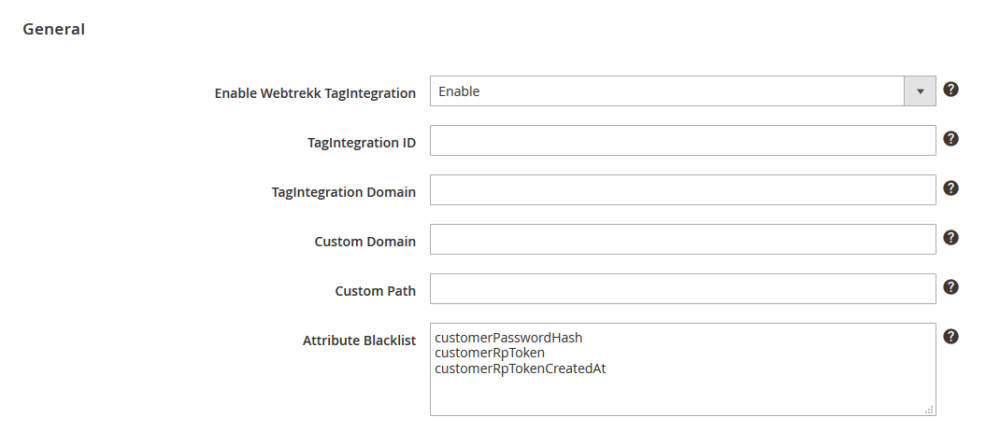

Integration and Configuration of the Webtrekk Magento2 Extension | Version $version$

# Introduction

The Webtrekk Magento2 extension enables you to integrate the Webtrekk pixel into your Magento2 online shop simply and 
quickly. In the process, the Webtrekk pixel code (Version 4) will be added to each page of your shop. This, in turn, 
ensures all standard parameters are configured.

The following analyses will then be possible:

- Traffic analyses (incl. identification of (new & regular) visitors)
- E-commerce analyses (incl. product and order analyses, without any individual configuration options, however)
- Standard marketing analyses, i.e. automatic recognition of user origin, such as SEO, direct or referrer (without identification of the individual campaigns)
- Page analyses (incl. heatmaps)
- Action analyses
- Form analyses

The extension was developed for Magento v2.0.x und v2.1.x in combination with the Webtrekk pixel version 4. (i.e. you will 
need the corresponding pixel JS file and Webtrekk TagIntegration account in addition to the Magento2 extension).

This document provides an overview of the values set on the individual pages and explains the integration of the extension 
into your Magento2 system.

# Magento2 extension

## How it Works

The extension handles the creation of a pixel concept for you. The Webtrekk pixel parameters are configured automatically 
based on the product information in Magento2.

The generation of these parameter values (e.g. creation of the page names) is completed with the help of predefined 
algorithms.

Some of the functions, such as the action, heatmap and form tracking functions, can be activated or deactivated 
manually on each page based on your individual requirements. 

## Installation

To start the installation, unzip the ZIP-archive on your server at "<Magento2 install DIR>/app/code". Now install and 
activate the extension through the following command.

```example
# php bin/magento setup:upgrade
# php bin/magento setup:static-content:deploy
```

Afterwards clear your cache in your Magento2 Admin-Panel at "System > Cache Management".

## Configuration

After the installation is finished, go to "Stores > Configuration > Webtrekk > TagIntegration", chose for which shop 
"Webtrekk TagIntegration" should be activated and set your basic configuration.



- **Enable Webtrekk TagIntegration:** Here you can activate and deactivate the webtrekk extension.
- **Webtrekk JavaScript file:** The URL to the JavaScript which contains the tracking code (/webtrekk_v4.min.js). If that input stays empty the included default javascript file is used (Webtrekk Pixel v435).
- **Async:** Defines whether the TagIntegration container should be loaded asynchronously.
- **TagIntegration ID:** Enter your TagIntegration customer ID here, if the TagIntegration file should be loaded from a Webtrekk server.
- **TagIntegration Domain:** Enter the TagIntegration domain here, if the TagIntegration file should be loaded from a Webtrekk server.
- **Custom Domain:** Enter your domain here, if the TagIntegration file should be loaded from your server.
- **Custom Path:** Enter the path to your JavaScript file here, if the TagIntegration file should be loaded from your server.
- **Attribute Blacklist:** You can put here a list of all attributes that should be filtered out of the data layer, separated by semicolon. For example you can exclude the following attributes like this "customer\*", "orderPayment\*", "orderBilling\*" und "orderShipping\*".

# Generation of the parameter values

The Webtrekk implementation is based on the naming of the pages. Magento2 pages can generally be split up into product 
pages (detailed product views and product category pages) and separate "special pages". The extension always forms 
these so-called content IDs (corresponds with the page name) using these values and the page title:

```info
[Language].[Action1].[Action2].[...].[ActionN].[Pagetitle]
```

These page names are enriched with additional parameters based on the respective page type. They are not, however, made 
up of different values, as is the case with content IDs, but are created based on the corresponding Magento2 fields.

Below is an overview of the parameters used:

| Webtrekk parameter | Description | Pages with the parameter |
| ------ | ------ | ------ |
| Content groups | Content-based breakdown of the website based on your product categories or some other associated function | All pages (except the start page) |
| Product | Name of a product | Product views, adding to the shopping basket, order confirmation page |
| Product quantity | Number of products added/ordered | Adding to the shopping basket, order confirmation page |
| Product categories | Breakdown of the products into their hierarchical categories | All pages containing information on individual products (e.g. pages with product details/order confirmation pages) |
| Product status | Updates the product with the current status: "view", "add" or "conf" | Product views, adding to the shopping basket, order confirmation page |
| Order ID | Order number produced when an order is concluded | Order confirmation page |
| Order value | Value of an order | Order confirmation page |
| Internal search terms | Searches performed on your website | Search results page |
| Customer ID | E-mail address as MD5 | Provided as soon as the user logs in |

The following table includes examples per type with the set values. These values will be pushed into a datalayer. With 
this datalayer you can create paramaters in Webtrekk Tag Integration and use them to configure webtrekk tracking extension.

```js
// Example of a data layer on the product detail page:

window._ti = {
    "pageAction": "catalog_product_view",
    "pageRoute": "catalog",
    "pageLocale": "de_DE",
    "pageLanguage": "de",
    "pageTitle": "Crown Summit Backpack",
    "pageCategory1": "Catalog",
    "pageCategory2": "Product",
    "pageCategory3": "View",
    "pageContentId": "de.Catalog.Product.View.Crown Summit Backpack",
    "productCategory1": "Gear",
    "productCategory2": "Bags",
    "productAvailableInCategory": ["Gear", "Bags"],
    "productEntityId": "3",
    "productTypeId": "simple",
    "productAttributeSetId": "15",
    "productStatus": "view",
    "productName": "Crown Summit Backpack",
    "productCreatedAt": "2016-09-16 07:47:28",
    "productUpdatedAt": "2016-09-16 07:47:28",
    "productSku": "24-MB03",
    "productPrice": "38.00",
    "productTaxClassId": "2",
    "productQuantityAndStockStatusIsInStock": "1",
    "productQuantityAndStockStatusQty": "99",
    "productWeight": "2.00",
    "productVisibility": "4",
    "productCategoryIds": ["3", "4"],
    "productActivity": [
        "Gym", "Hiking", "Overnight", "School", 
        "Trail", "Travel", "Urban"
    ],
    "productStyleBags": "Backpack",
    "productMaterial": ["Nylon", "Polyester"],
    "productColor": "Black",
    "productStrapBags": ["Adjustable", "Double", "Padded"],
    "productFeaturesBags": [
        "Audio Pocket", "Waterproof", "Lightweight",
        "Reflective", "Laptop Sleeve"
    ],
    "productDescription": "",
    "productShortDescription": "",
    "productImage": "/m/b/mb03-black-0.jpg",
    "productSmallImage": "/m/b/mb03-black-0.jpg",
    "productThumbnail": "/m/b/mb03-black-0.jpg",
    "productUrlKey": "crown-summit-backpack",
    "productQuantity": "1",
    "blacklist": ["customerPasswordHash", "customerRpToken", "customerRpTokenCreatedAt"]
};
```

Those parameters that always have the same value have been flagged in the "Fixed" column. The values are always passed 
in English. The values of the parameters flagged under "Dynamic" are determined dynamically.

| Page | TagIntegration DataLayer | Example | Fixed | Dynamic |
| ------ | ------ | ------ | :----: | :----: |
| Home Page | pageContentId | en.Cms.Home Page | no | yes |
|  | pageAction | cms_index_index | no | yes |
|  | pageRoute | cms | no | yes |
|  | pageCategory1 | Cms | no | yes |
| Category page | pageContentId | en.Catalog.Category.View.Bags | no | yes |
|  | pageAction | catalog_category_view | no | yes |
|  | pageRoute | catalog | no | yes |
|  | pageCategory1...5 | Catalog | no | yes |
|  | productCategory1...5 | Bags | no | yes |
| Shopping basket page | pageContentId | en.Checkout.Cart.Shopping Cart | no | yes |
|  | pageAction | checkout_cart_index | no | yes |
|  | pageRoute | checkout | no | yes |
|  | pageCategory1 | Checkout | no | yes |
|  | pageCategory2 | Cart | no | yes |
| View product | pageContentId | en.Catalog.Product.View.Crown Summit Backpack | no | yes |
|  | pageAction | catalog_product_view | no | yes |
|  | pageRoute | catalog | no | yes |
|  | productName | Crown Summit Backpack | no | yes |
|  | productSku | 24-MB03 | no | yes |
|  | productPrice | 38.00 | no | yes |
|  | productStatus | view | yes | no |
| Add product to shopping basket | pageContentId | en.Catalog.Product.View.Crown Summit Backpack | no | yes |
|  | pageAction | catalog_product_view | no | yes |
|  | pageRoute | catalog | no | yes |
|  | addProductName | Crown Summit Backpack | no | yes |
|  | addProductSku | 24-MB03 | no | yes |
|  | addProductQuantity | 1 | no | yes |
|  | addProductPrice | 38.00 | no | yes |
|  | addProductStatus | add | yes | no |
| Order – confirmation page | pageContentId | en.Checkout.Onepage.Success.Success Page | no | yes |
|  | pageCategory1 | Checkout | no | yes |
|  | pageCategory2 | Onepage | no | yes |
|  | pageCategory3 | Success | no | yes |
|  | productName | Crown Summit Backpack | no | yes |
|  | productSku | 24-MB03 | no | yes |
|  | productQuantity | 1 | no | yes |
|  | productPrice | 38.00 | no | yes |
|  | productStatus | conf | yes | no |
|  | orderId | 000000011 | no | yes |
|  | orderValue | 43.00 | no | yes |
|  | orderCurrency | EUR | no | yes |
|  | orderWeight | 2.50 | no | yes |
|  | orderShippingDescription | Flat Rate - Fixed | no | yes |
|  | orderShippingAmount | 5.00 | no | yes |
|  | orderPaymentMethod | Mastercard | no | yes |
| Login page | pageContentId | en.Customer.Account.Login.Customer Login | no | yes |
|  | pageAction | customer_account_login | no | yes |
|  | pageRoute | customer | no | yes |
|  | pageCategory1 | Customer | no | yes |
|  | pageCategory2 | Account | no | yes |
|  | pageCategory3 | Login | no | yes |
| Account area | pageContentId | en.Customer.Account.My Account | no | yes |
|  | pageAction | customer_account_index | no | yes |
|  | pageRoute | customer | no | yes |
|  | pageCategory1 | Customer | no | yes |
|  | pageCategory2 | Account | no | yes |
| Search (normal) | pageContentId | de.Catalogsearch.Result.Search | no | yes |
|  | pageAction | catalogsearch_result_index | no | yes |
|  | pageRoute | catalogsearch | no | yes |
|  | pageCategory1 | Catalogsearch | yes | no |
|  | pageCategory2 | Result | no | yes |
|  | pageSearchType | normal | no | yes |
|  | pageSearchTerm | back | no | yes |
| Search (advanced) | pageContentId | de.Catalogsearch.Advanced.Result.Search | no | yes |
|  | pageAction | catalogsearch_advanced_result | no | yes |
|  | pageRoute | catalogsearch | no | yes |
|  | pageCategory1 | Catalogsearch | no | yes |
|  | pageCategory2 | Advanced | no | yes |
|  | pageCategory2 | Result | no | yes |
|  | pageSearchType | advanced | no | yes |
|  | pageSearchTerm | back | no | yes |
|  | pageSearchResults | 4 | no | yes |
| Contact | pageContentId | de.Contact.Contact Us | yes | no |
|  | pageAction | contact_index_index | no | yes |
|  | pageRoute | contact | no | yes |
|  | pageCategory1 | Contact | yes | no |
| Logged in user | customerEntityId | 12 | no | yes |
|  | customerIsActive | 1 | no | yes |
| Cross Device Bridge | customerCDBEmailMd5 | ef8ca1c0ff7d2e34dc0953d4222655b8 | no | yes |
|  | customerCDBEmailSha256 | 1f9e575ad4234c30a81d30c70affd4bb a7b0d57d8e8607ad255496863d72c8bb | no | yes |
|  | customerCDBTelephoneMd5 | 781e5e245d69b566979b86e28d23f2c7 | no | yes |
|  | customerCDBTelephoneSha256 | 84d89877f0d4041efb6bf91a16f0248f 2fd573e6af05c19f96bedb9f882f7882 | no | yes |
|  | customerCDBAddressMd5 | f97aff0b50eccd327e5df9e7348ad45b | no | yes |
|  | customerCDBAddressSha256 | 82785713d6f7029a12c37136627ed112 48ccc8a6f50cd4de162614e5ccf6f79e | no | yes |

## Activating the tracking function

Tracking can be extended by entering heatmap, form and action data. All of these functions can be activated/deactivated 
globally for all pages or for individual pages.

- **Action tracking:** measures clicks of internal links. The target URL of the respective link is used as the action name
- **Heatmap:** graphical analyses, which display where a user clicks with the help of coordinate details
- **Forms:** enables internal forms to be evaluated

# Parameter configuration

Some of the parameters used by the extension are not configured by default in Webtrekk. These parameters
must therefore be configured before any data is entered/collected.

The configuration is carried out in your Webtrekk account under "Configuration > Categorisation" (content
groups, product categories) or "Configuration > Own Parameters".

```info
Note: Please contact the webtrekk support team, to access predefined parameters.
```

# Contact

Please don't hesitate to contact us if you have any questions about using the product. Webtrekk offers
various support packages for priority support or comprehensive advice. Please feel free to contact us to
obtain your own personalised offer.

Webtrekk GmbH   
Robert-Koch-Platz 4   
10115 Berlin

fon 030 - 755 415 - 0   
fax 030 - 755 415 - 100   
support@webtrekk.com

[www.webtrekk.com](https://www.webtrekk.com)